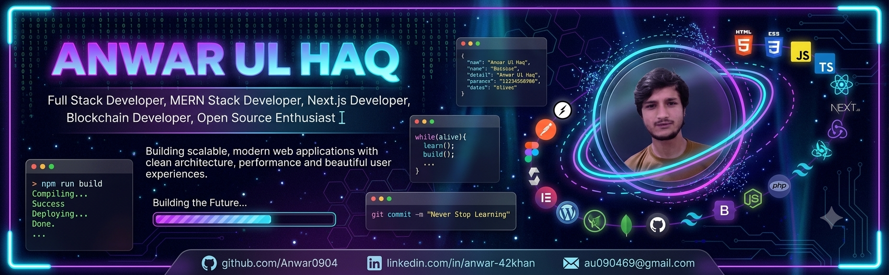

<div align="center">


# Hi 👋 I'm Anwar Ul Haq

### 🚀 Full Stack Developer • MERN Stack • Next.js • Blockchain Developer


</div>

<p align="center">


</p>

---

# 💫 About Me

```ts
const anwar = {
    location: "Pakistan 🇵🇰",

    role: "Full Stack Developer",

    specialization: [
        "MERN Stack",
        "Next.js",
        "Blockchain",
        "WordPress"
    ],

    currentlyLearning: [
        "System Design",
        "Web3",
        "DevOps"
    ],

    motto: "Learn • Build • Improve • Repeat"
}
```

---

# ⚒️ Tech Stack

## Frontend

<p align="center">


</p>

## Backend

<p align="center">


</p>

## Blockchain

<p align="center">


</p>

## CMS

<p align="center"> 


</p>

## Tools

<p align="center">


</p>

---

# 🚀 Featured Projects
<div align="center">

| Project | Tech |
|----------|------|
| 🩸 Blood Connect | Next.js • MongoDB • TypeScript |
| 🏢 ADM CMS | Next.js • Node.js • MongoDB |
| 💰 Expense Tracker | MERN Stack |
| 🔗 Solidity Smart Contracts | Solidity • Hardhat |
</div>

---

# 🔥 GitHub Streak

<p align="center">

</p>

---

# 📈 Contribution Graph

<p align="center">


</p>

---

# 🐍 Contribution Snake

<p align="center">


</p>

---

# 🤝 Connect With Me

<p align="center">

<a href="https://github.com/Anwar0904">

</a>

<a href="https://linkedin.com/in/anwar-42khan">

</a>

<a href="mailto:au090469@gmail.com">

</a>

</p>

---

<div align="center">

### ⭐ Thanks for visiting my profile!

*"Code. Learn. Build. Repeat."*

</div>
